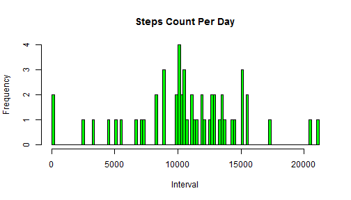
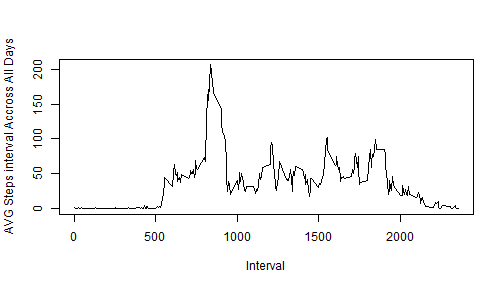
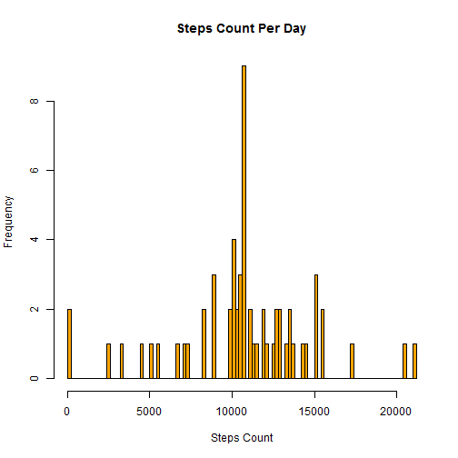

```r
## Loading and preprocessing the data
#set the working Directory
setwd("D:\\Shafei\\CourseraDataSC\\ReproducibleResearchWD")

#Read the Activity data, set the header reading flag to true as the first row in the CSV is the coulmn headers
activityMonitoringData<-read.csv("./repdata_data_activity/activity.csv",header = TRUE,
                                 colClasses=c("integer","Date","integer"))
```

## What is mean total number of steps taken per day?

```r
#load plyr package
library(plyr)
#Calculate the total number of steps taken per day
totalStepsPerDay<-ddply(activityMonitoringData,.(date),summarize,StepsCount=sum(steps))

hist(stepsCountPerDay$stepsCount,col='green',breaks=100,xlab="Interval",main ='Steps Count Per Day')
```

 

```r
meanNumberofStepsTakenperDay = mean(stepsCountPerDay$stepsCount,na.rm = TRUE)
medianNumberofStepsTakenperDay= median(stepsCountPerDay$stepsCount,na.rm = TRUE)
```

The Mean Number Of Steps Taken Per Day is 1.0766189 &times; 10<sup>4</sup> And The Medain Number Of Steps Taken Per Day is 10765

## What is the average daily activity pattern?

```r
#Calculate the mean of steps for each interval accross all the days
avgStepsIntervalAccrossAllDays<-ddply(activityMonitoringData,.(interval),summarize,
                                      StepsIntrvMean= mean(steps,na.rm = TRUE))

#Plot the digram of averaged steps intervals accross all days
plot(avgStepsIntervalAccrossAllDays$interval,avgStepsIntervalAccrossAllDays$StepsIntrvMean,type='l'
     ,xlab="Interval",ylab="AVG Steps interval Accross All Days")
```

 

```r
maxIntervlaStepsAverged = avgStepsIntervalAccrossAllDays[which.max( avgStepsIntervalAccrossAllDays[,2] ),1]
```

The Max Avergae Number Of Steps Taken Per Inetrval Accross All Days is taken by interval 835

## Imputing missing values

```r
NONA = sum(is.na(activityMonitoringData$steps))

##We will use the averaged steps interval accross all days to replace the NA
#Copy the original data
clearedactivityMonitoringData<-activityMonitoringData
#Copy the Avergaed of interval steps accross All Days
clearedactivityMonitoringData$steps <- 
  ifelse(is.na(clearedactivityMonitoringData$steps) == TRUE, 
         avgStepsIntervalAccrossAllDays$StepsIntrvMean
         [avgStepsIntervalAccrossAllDays$interval %in% clearedactivityMonitoringData$interval], 
         clearedactivityMonitoringData$steps)

clearedTotalStepsPerDay<-ddply(clearedactivityMonitoringData,.(date),summarize,StepsCount=sum(steps))
hist(clearedTotalStepsPerDay$StepsCount,col='orange',breaks=100,xlab="Steps Count",main ='Steps Count Per Day')
```

 

```r
clearMeanNumberofStepsTakenperDay = mean(clearedTotalStepsPerDay$StepsCount,na.rm = TRUE)
clearMedianNumberofStepsTakenperDay= median(clearedTotalStepsPerDay$StepsCount,na.rm = TRUE)
```
The total NO OF NAs in data is  2304

And Here The Mean Number Of Steps Taken Per Day is 1.0766189 &times; 10<sup>4</sup> And The Medain Number Of Steps Taken Per Day is 1.0766189 &times; 10<sup>4</sup> after Imputing the NA values with the means of steps interval accross All Days.

## Are there differences in activity patterns between weekdays and weekends?

```r
#Check weekday and weekend
weekendDays<- c('Saturday','Sunday')
#create a new logical factors to indicate weekend day or not
clearedactivityMonitoringData$weekday = ifelse(
  weekdays(clearedactivityMonitoringData$date) %in% weekends,TRUE,FALSE)

#Calaculate the Avergare Steps taken across all
avgStepsIntervalAccrossWeekDays<-ddply(clearedactivityMonitoringData,.(interval,weekday),summarize,
                                      StepsIntrvMean= mean(steps,na.rm = TRUE))
f<-factor(avgStepsIntervalAccrossWeekDays$weekday,labels= c('Weekday','Weekend'))

#load lattice library
library(lattice)
xyplot(avgStepsIntervalAccrossWeekDays$StepsIntrvMean 
       ~avgStepsIntervalAccrossWeekDays$interval|f ,layout = c(1,2),type='l',
       xlab="Interval",ylab="Number Of Steps")
```

 
